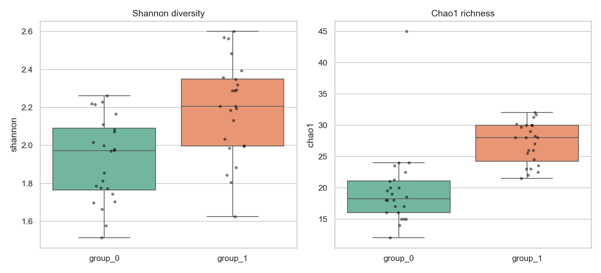
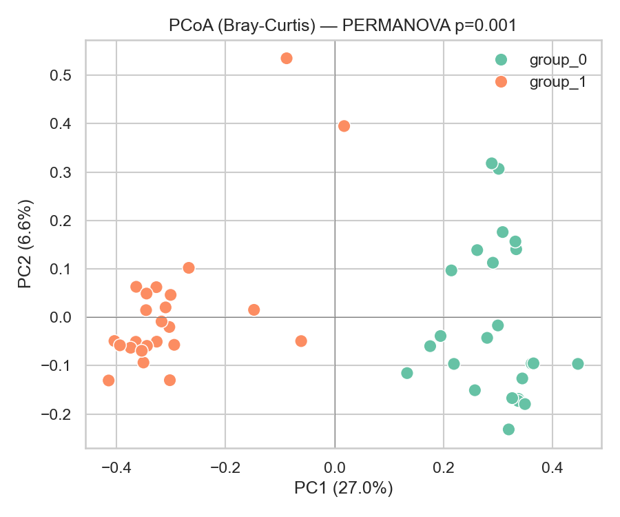
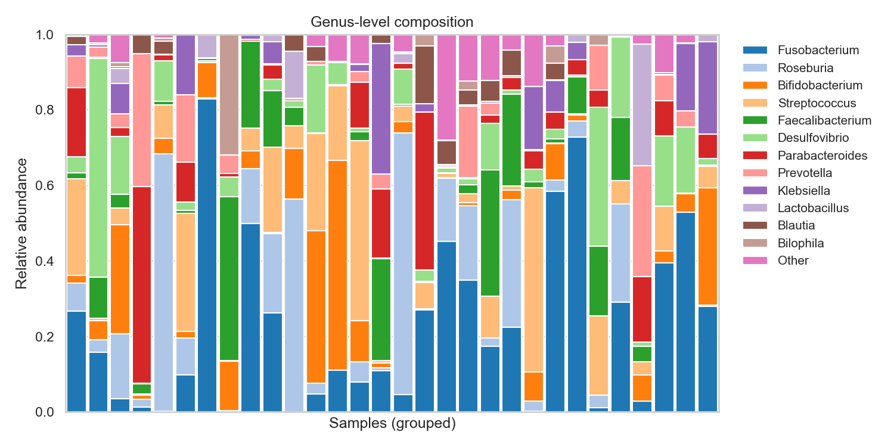
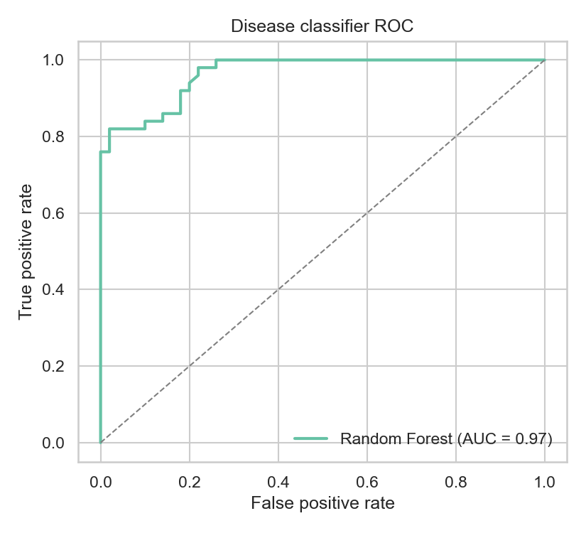
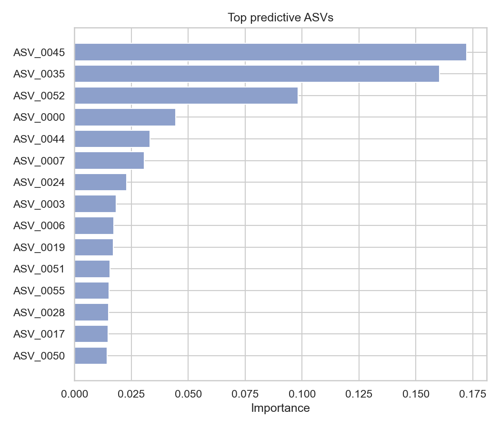
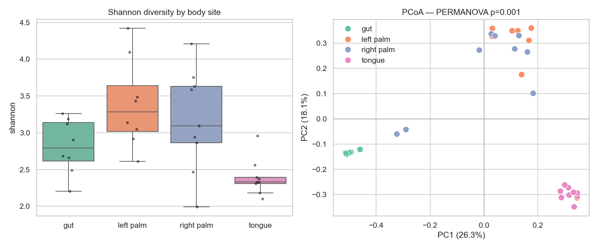
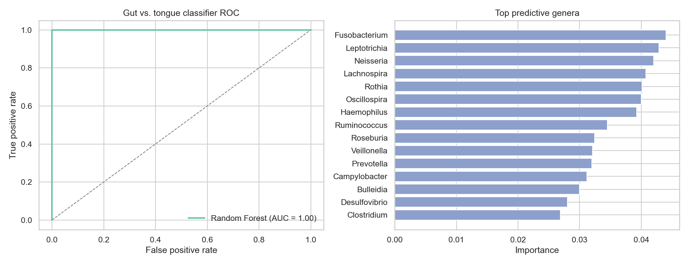

# amplicon-diversity

A small, well-tested Python toolkit for **16S/18S rRNA amplicon (ASV-based)**
microbial community analysis: diversity ecology, taxonomic profiling, and
machine learning on compositional data — with runnable examples, figures,
and unit tests.

Every statistic and plot is implemented from first principles (NumPy/SciPy/
scikit-learn), not just called from an existing bioinformatics package — the
goal is to show the underlying methods, not hide them behind a black box.

This is scoped to amplicon data specifically (working at **ASV**, not
97%-similarity OTU, resolution — see [Design notes](#design-notes)). It's
one repo in a small set of focused, single-topic portfolio projects rather
than one large toolkit spanning every kind of -omics data.

## Why this exists

This is a portfolio project: a compact demonstration of how I approach
scientific software — package structure, reproducible synthetic data for
testing, an honest end-to-end run on real published data, and figures that
would hold up in a lab meeting.

## Install

```bash
git clone https://github.com/danilodileo/16s-amplicon-diversity.git
cd 16s-amplicon-diversity
python -m venv .venv && source .venv/bin/activate
pip install -e ".[dev]"
pytest
```

## Quickstart

```python
from amplicon_diversity.simulate import simulate_asv_table
from amplicon_diversity.diversity import alpha_diversity, beta_diversity, pcoa
from amplicon_diversity.stats import permanova
from amplicon_diversity.viz import plot_ordination

counts, groups = simulate_asv_table(n_samples=48, n_features=80, seed=42)

shannon = alpha_diversity(counts, metric="shannon")
dist = beta_diversity(counts, metric="bray_curtis")
coords, explained = pcoa(dist)
result = permanova(dist, groups)

plot_ordination(coords, groups, explained_variance=explained,
                 title=f"PCoA — PERMANOVA p={result['p_value']:.3f}")
```

## What's in the package

| Module | Covers | Key functions |
|---|---|---|
| [`amplicon_diversity.diversity`](src/amplicon_diversity/diversity) | Alpha/beta diversity, ordination | `shannon`, `chao1`, `bray_curtis`, `pcoa`, `nmds` |
| [`amplicon_diversity.taxonomy`](src/amplicon_diversity/taxonomy) | ASV taxonomy & composition | `parse_qiime2_taxonomy`, `collapse_to_rank`, `top_taxa`, `core_taxa` |
| [`amplicon_diversity.stats`](src/amplicon_diversity/stats) | Group-comparison statistics | `differential_abundance`, `permanova` |
| [`amplicon_diversity.ml`](src/amplicon_diversity/ml) | ML on compositional data | `clr_transform`, `cross_validate_classifier`, `feature_importance` |
| [`amplicon_diversity.viz`](src/amplicon_diversity/viz) | Shared plotting | boxplots, ordination, taxa barplots, volcano, heatmap, ROC |
| [`amplicon_diversity.io`](src/amplicon_diversity/io) | Table I/O & validation | `load_abundance_table`, `save_abundance_table`, `validate_table` |
| [`amplicon_diversity.simulate`](src/amplicon_diversity/simulate) | Synthetic data generators | `simulate_asv_table`, `simulate_taxonomy` |

All abundance data follows one convention throughout: **samples as rows,
features (ASVs) as columns**.

## Examples

Each script in [`examples/`](examples) is runnable end to end and saves its
figures to [`figures/`](figures).

1. [`01_diversity_ecology.py`](examples/01_diversity_ecology.py) — alpha/beta diversity, PCoA, PERMANOVA
2. [`02_taxonomic_composition.py`](examples/02_taxonomic_composition.py) — rank collapsing, composition barplot, core microbiome
3. [`03_ml_classifier.py`](examples/03_ml_classifier.py) — CLR + random forest + ROC + feature importance
4. [`04_real_data_moving_pictures.py`](examples/04_real_data_moving_pictures.py) — the whole pipeline on a **real published ASV dataset** (see below)

### Diversity & ordination (synthetic)

Two simulated groups with a known compositional shift — alpha diversity is
higher in group 1, and PERMANOVA confirms the groups separate in Bray-Curtis
space (p = 0.001):




### Taxonomic composition (synthetic)

Genus-level composition across samples, and the "core" genera present in
≥80% of them:



### Machine learning: disease classifier (synthetic)

CLR-transformed abundances, 5-fold cross-validated random forest:




### Real data: QIIME2 "Moving Pictures" — human microbiome across body sites

[`data/example/`](data/example) bundles the official **QIIME2 tutorial**
ASV dataset (Caporaso et al. 2011, *Genome Biology* — see
[`data/example/README.md`](data/example/README.md) for full provenance and
licensing notes): 34 real samples from 2 subjects across 4 body sites (gut,
tongue, left palm, right palm), denoised to **750 real ASVs** with DADA2 —
not OTU clustering.

Body site is one of the strongest signals in human microbiome ecology, and
the toolkit recovers it cleanly: PERMANOVA p = 0.001 across all four sites,
and a gut-vs-tongue random forest classifier hits 100% cross-validated
accuracy — not overfitting, just genuinely easy biology (the top predictive
genera are textbook oral taxa — *Fusobacterium*, *Leptotrichia*, *Neisseria*
— vs. textbook gut taxa — *Faecalibacterium*, *Roseburia*, *Ruminococcus*).




## Testing

45 tests, 95% coverage, run in CI on Python 3.9–3.12 ([`.github/workflows/ci.yml`](.github/workflows/ci.yml)):

```bash
pytest --cov=amplicon_diversity --cov-report=term-missing
```

Every statistical function is tested against known analytical properties
(e.g. Shannon entropy of a uniform distribution equals log(richness),
Bray-Curtis of identical samples is 0) rather than just "does it run", and
`amplicon_diversity.simulate` gives every test a reproducible, known ground
truth (e.g. which ASVs are truly differentially abundant) to check recovery
against.

## Design notes

- **ASVs, not OTUs**: every example — synthetic and real — works at
  amplicon sequence variant (exact-sequence) resolution, the modern
  DADA2/Deblur replacement for 97%-similarity OTU clustering. The real
  dataset is QIIME2's own DADA2 output, and `taxonomy.parse_qiime2_taxonomy`
  reads the format QIIME2's `classify-sklearn` actually produces — not a
  shotgun-metagenomics classifier's output (that's a different data type
  and belongs in a separate repo).
- **Compositional-data aware**: `ml.clr_transform` and the differential
  abundance tests operate on relative abundances / CLR space, not raw
  counts, which is the standard way to avoid spurious correlations in
  microbiome data.
- **No black boxes**: diversity indices, PCoA, and PERMANOVA are implemented
  directly from their definitions (not wrapped from scikit-bio/vegan), so
  the math is inspectable.
- **Species-level taxonomy is deliberately left blank** in the synthetic
  generator: a single 16S hypervariable region genuinely can't resolve
  species reliably, and pretending otherwise would be a modeling error, not
  a simplification.

## License

MIT for the code (see [LICENSE](LICENSE)). The example dataset in
`data/example/` has separate, more restrictive provenance notes — see
[`data/example/README.md`](data/example/README.md) before reusing it
outside this repo.
